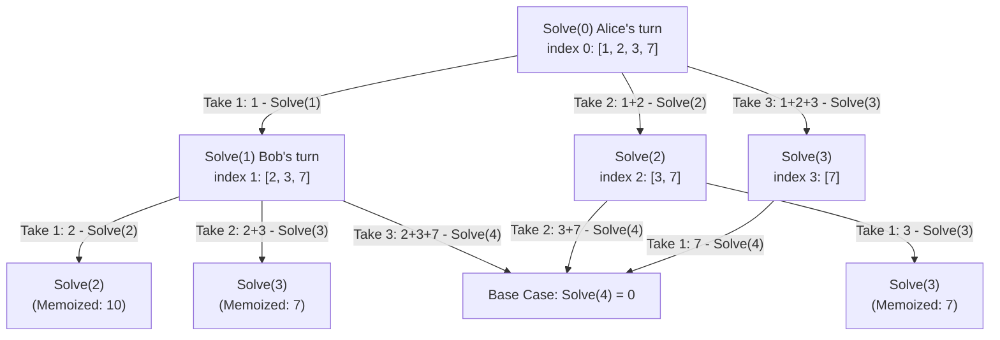

Question: https://leetcode.com/problems/stone-game-iii/

Explanation : https://www.youtube.com/watch?v=KI8suf35r38

```cs
public class Solution 
{
    public string StoneGameIII(int[] stoneValue) 
    {
        int[] dp = new int[stoneValue.Length + 1];
        Array.Fill(dp, -1);
        int difference = Solve(stoneValue, 0, dp);

        if (difference > 0)
            return "Alice";
        if (difference < 0)
            return "Bob";
        
        return "Tie";
    }

    private int Solve(int[] stoneValue, int index, int[] dp)
    {
        if (index >= stoneValue.Length)
            return 0;

        if (dp[index] != -1)
            return dp[index];

        int result = stoneValue[index] - Solve(stoneValue, index + 1, dp);
        
        if (index + 1 < stoneValue.Length)
        {
            result = Math.Max(result, stoneValue[index] + stoneValue[index + 1] - Solve(stoneValue, index + 2, dp));
        }

        if (index + 2 < stoneValue.Length)
        {
            result = Math.Max(result, stoneValue[index] + stoneValue[index + 1] + stoneValue[index + 2] - Solve(stoneValue, index + 3, dp));
        }

        return dp[index] = result;
    }
}
```


``

### Complexity Analysis

- **Time Complexity:** $O(N)$, where $N$ is the number of elements in `stoneValue`.
    
    - Each state `index` from `0` to `N` is computed at most once due to memoization (`dp`).
        
    - For each state, the function performs a constant number of operations (up to 3 transitions/branches).
        
- **Space Complexity:** $O(N)$
    
    - **Memoization Array:** The `dp` array uses $O(N)$ space to store subproblem results.
        
    - **Recursion Stack:** The maximum depth of the call stack is $N + 1$ in the worst case, requiring $O(N)$ space.
    

> **Space Optimization Tip:** Since `dp[i]` only depends on the next 3 states (`dp[i+1]`, `dp[i+2]`, `dp[i+3]`), you can optimize the space to **$O(1)$** using just 3 variables instead of an entire array of size $N+1$.


```cs
using System;

public class Solution 
{
    public string StoneGameIII(int[] stoneValue) 
    {
        int n = stoneValue.Length;
        
        // Represents dp[i + 1], dp[i + 2], dp[i + 3]
        int next1 = 0, next2 = 0, next3 = 0;

        for (int i = n - 1; i >= 0; i--) 
        {
            // Option 1: Take 1 stone
            int current = stoneValue[i] - next1;

            // Option 2: Take 2 stones
            if (i + 1 < n) 
            {
                current = Math.Max(current, stoneValue[i] + stoneValue[i + 1] - next2);
            }

            // Option 3: Take 3 stones
            if (i + 2 < n) 
            {
                current = Math.Max(current, stoneValue[i] + stoneValue[i + 1] + stoneValue[i + 2] - next3);
            }

            // Shift values for the next iteration moving left
            next3 = next2;
            next2 = next1;
            next1 = current;
        }

        int difference = next1; // dp[0]

        if (difference > 0) return "Alice";
        if (difference < 0) return "Bob";
        return "Tie";
    }
}
```
